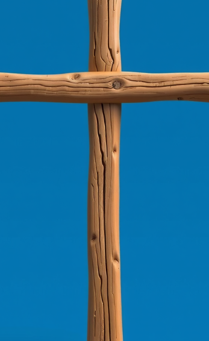
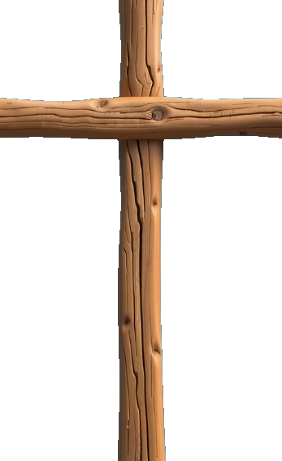

# floodfill-bg

Flood-fill background removal tool. Removes background by starting from seed points and spreading to nearby pixels within a color threshold.

## Install

```bash
git clone https://github.com/Morass/floodfill-bg
cd floodfill-bg
pip install .
```

## Options

| Option | Short | Description |
|--------|-------|-------------|
| `--output` | `-o` | Output path. Default: `/tmp/<name>_cleaned.png` |
| `--seed` | `-s` | Seed point `x,y` or `x%,y%`. Repeatable. |
| `--auto-corners` | `-c` | Use all 4 corners as seeds |
| `--threshold` | `-t` | Color distance 0-441. Default: 50 |
| `--global` | `-g` | Global purge: remove ALL pixels matching seed colors |
| `--trim` | | Trim transparent edges after processing |
| `--8-way` | | Include diagonal neighbors (flood-fill mode only) |
| `--info` | `-i` | Print dimensions and exit |

## Modes

**Flood-fill (default):** Starts from seeds, spreads to connected pixels within threshold. Good for removing backgrounds that are continuous.

**Global (`--global`):** Scans ALL pixels, removes any within threshold of seed colors. Good for removing colors that appear in multiple disconnected areas.

## Examples

### Seed + trim

```bash
floodfill-bg jewel.png --seed 10%,10% --trim
```

| Input | Output |
|-------|--------|
|  |  |

### Auto-corners

```bash
floodfill-bg cross.png --auto-corners
```

| Input | Output |
|-------|--------|
|  |  |

### Global mode

```bash
floodfill-bg demo.png --seed 0,0 --global
```

| Input | Output |
|-------|--------|
|  |  |
